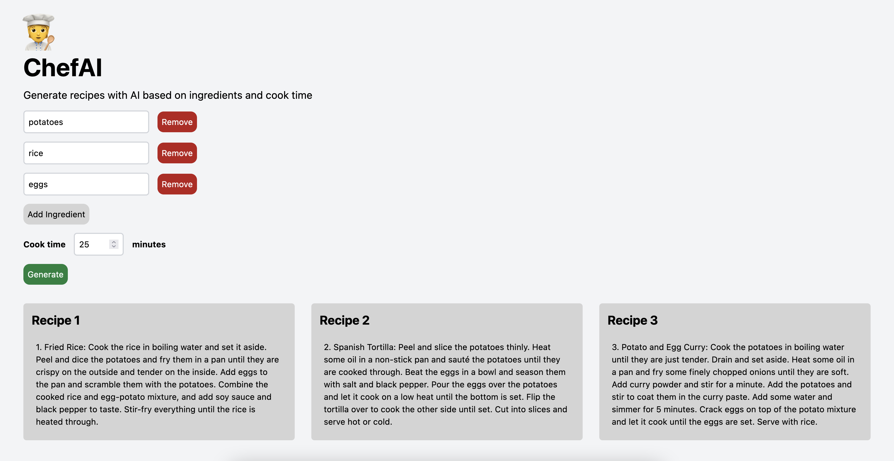

# Chef AI 🧑‍🍳

Webapp that generates recipes based on ingredients and cooking time. Built with OpenAI API, Next.js, and Tailwind CSS.

The app is part of the _How to build an AI app_ workshop by [Elena Lape](https://twitter.com/elena_lape) presented at [Hack the Burgh 2023](https://hacktheburgh.com) 4-5 March 2023.



## Prerequisites

- [Node.js](https://nodejs.org/en/download/) installed on your machine
- [OpenAI account & API key](https://platform.openai.com/account/api-keys)

## Built with

- [Next.js](https://nextjs.org/) — a React framework for building static and server-rendered apps and websites
- [Tailwind CSS](https://tailwindcss.com/) — a utility-first CSS framework (tldr; it lets you write CSS in shortcodes)
- [OpenAI API](https://openai.com/) — an API that lets you use AI to generate text & images

## Running locally

1. Clone the repo

```bash
git clone
```

2. Install dependencies

```bash
npm install
```

3. Create an `.env` file in the root directory and add your OpenAI API key, which you can get from [here](https://platform.openai.com/account/api-keys).

```bash
// .env
OPENAI_API_KEY=sk-xxxxxxx
```

4. Run the app

```bash
npm run dev
```

5. Open [http://localhost:3000](http://localhost:3000) with your browser to see the result.
